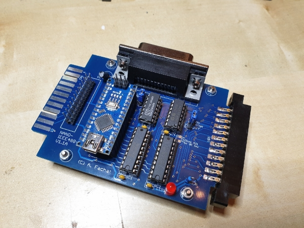
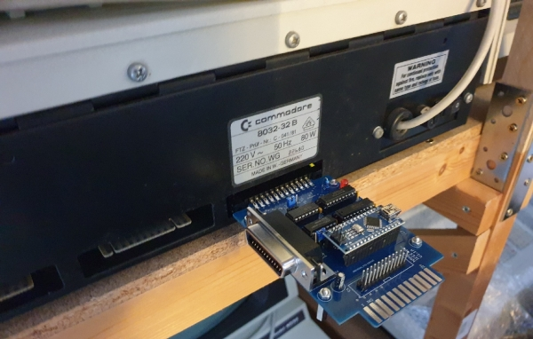
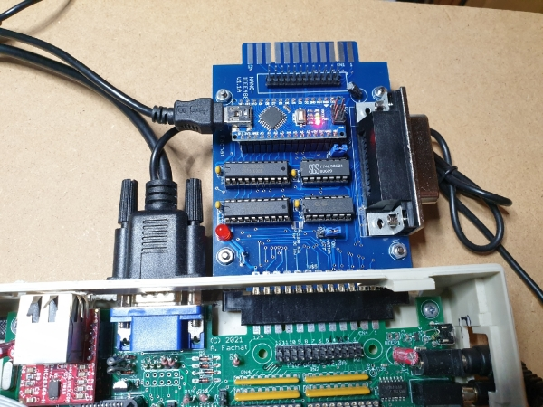

# nano488

An IEEE488 interface for the PC using USB and an Arduino Nano (tm)

## Design

This IEEE488 interfaces uses an Arduino Nano (tm) and its serial-over-USB interface to have a PC control the IEEE488 interface.

The design is made to be able to work as both, a controller or a device, but the main purpose is to work as
a disk drive for the Commodore PET computers.

The design is inspired by https://github.com/Twilight-Logic/AR488 but I had to rearrange some lines to
add the Commodore disk drive's ATNA response circuit.

Also, the design uses the standards compliant 75160/75161 IEEE488 drivers, so electrical specifications are met.

Note, that no extra power supply line e.g. to the tape port is required, as the board is using the 5V
supplied by the USB bus connector (via the Arduino nano (tm))

## Software

The software that supports the disk drive functionality is XD2031 ( https://github.com/fachat/XD2031 ) - for details see there.

## Boards

### V1.1B

This board has four IEEE488 connectors:

1. a board edge connector similar to the Commodore PET IEEE488 connector
2. a slot connector to plug the device directly onto the Commodore PET IEEE488 connector
3. a 24 pin standards IEEE488 connector for standard IEEE488 stacking cables
4. a 24 pin flat ribbon connector

Here are the design files:

- [Eagle schematics](v1.1b/nano_ieee488_v1.1b.sch)
- [Eagle layout](v1.1b/nano_ieee488_v1.1b.brd)
- [Schematics picture](v1.1b/nano_ieee488_v1.1b-sch.png)
- [Board parts layout](v1.1b/nano_ieee488_v1.1b-layout.png)
- [Board full layout](v1.1b/nano_ieee488_v1.1b-brd.png)
- [Gerber files](v1.1b/nano_ieee488_v1.1b-gerbers.zip)

### V1.0B

This board has four IEEE488 connectors:

1. a board edge connector similar to the Commodore PET IEEE488 connector
1. a 24 pin standards IEEE488 connector for standard IEEE488 stacking cables
1. a 24 pin flat ribbon connector

Here are the design files:

- [Eagle schematics](v1.0b/nano_ieee488_v1.0b.sch)
- [Eagle layout](v1.0b/nano_ieee488_v1.0b.brd)
- [Schematics picture](v1.0b/nano_ieee488_v1.0b-sch.png)
- [Board parts layout](v1.0b/nano_ieee488_v1.0b-layout.png)
- [Board full layout](v1.0b/nano_ieee488_v1.0b-brd.png)

## Gallery

